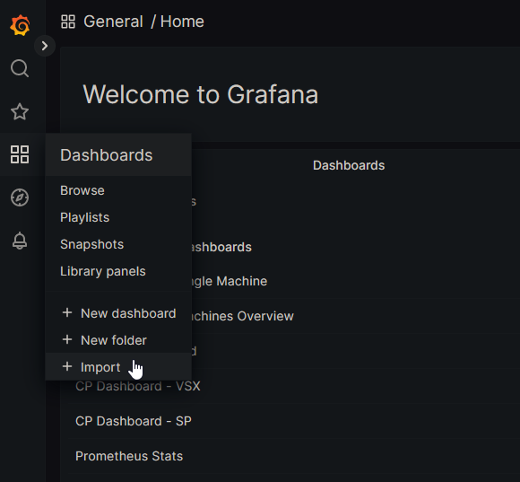
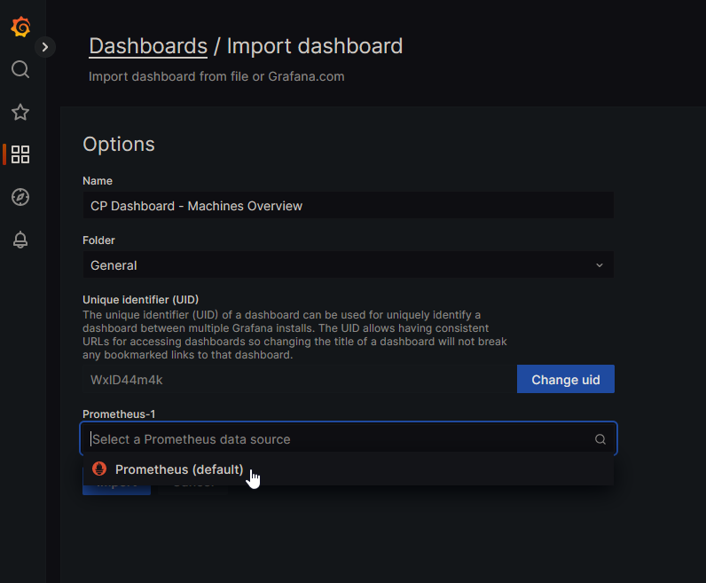
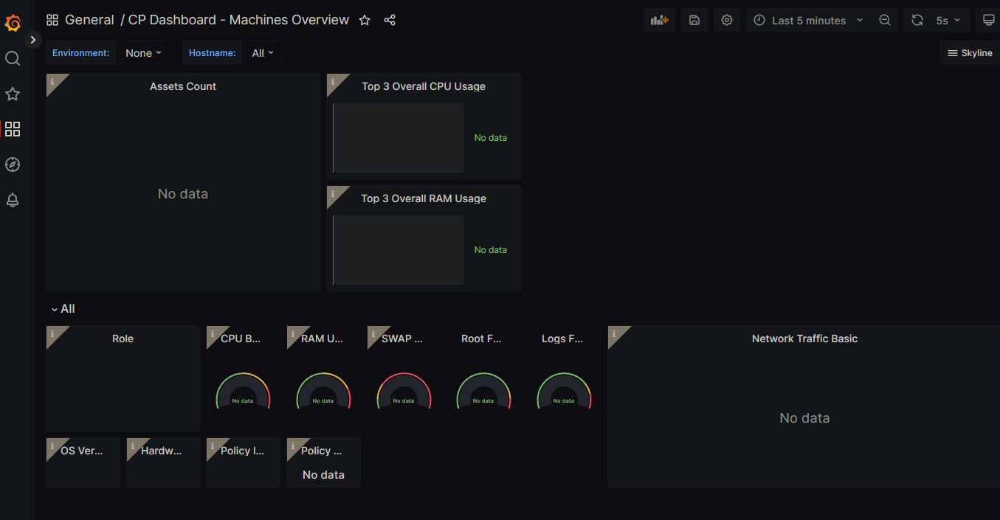
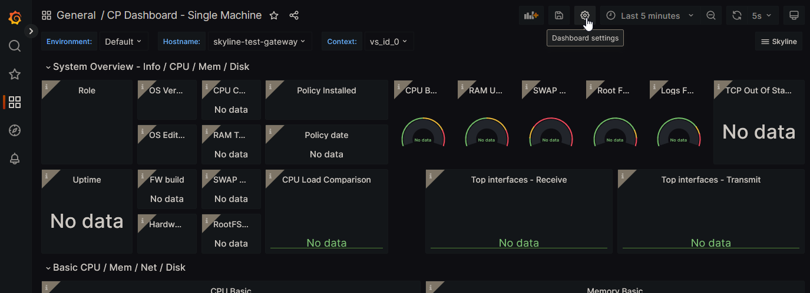
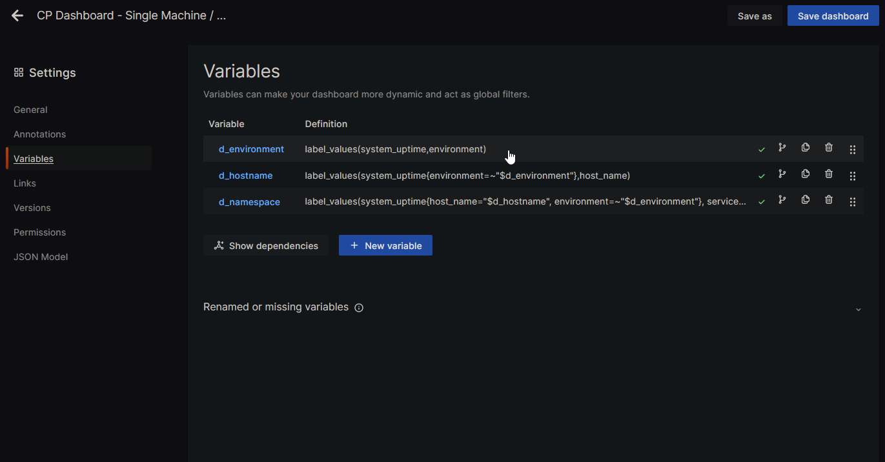
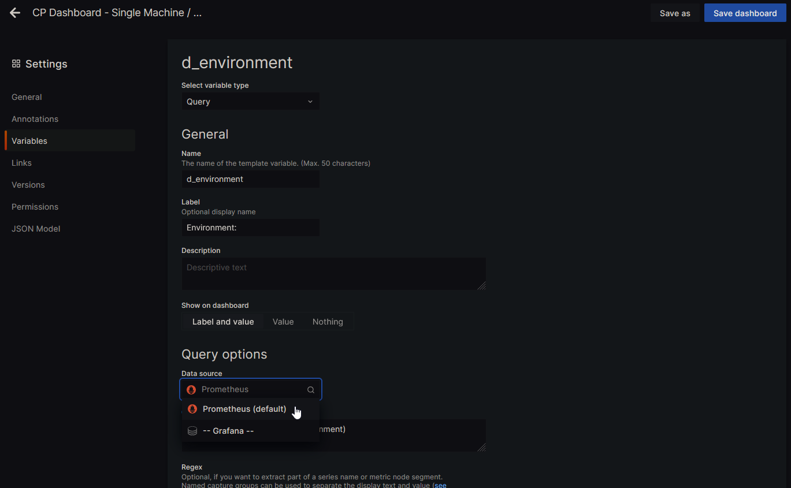

# Docker compose project for a Checkpoint Skyline environment

This is my attempt to make a docker-compose project to stand up a prometheus and grafana environment for [Checkpoint Skyline](https://supportcenter.checkpoint.com/supportcenter/portal?eventSubmit_doGoviewsolutiondetails=&solutionid=sk178566). I'm trying to approach this as a mostly step-by-step guide suitable for beginners to linux and or docker compose that already have a basic understanding of how to interact with and manage a linux system from the command line, so please forgive me if this get's a little long-winded.

This guide goes over setting up the application stack without using TLS since I run a separate load balancer and terminate all of my TLS there. In the future I may look into adding TLS to this application stack behind caddy, traefik or ngingx proxy manager.

I like to use opensuse tumbleweed but you're welcome to use any distro you'd like. As far as VM size goes, I've been using 4 cores, 32gb ram and 500gb of disk. You should be fine with running 8gb of ram, 32gb is likely overkill for my checkpoint environment, 8gb would likely be fine. Just make sure to install docker engine and docker compose. You can use the version included in your distro or you can install the latest and greatest build directly from Docker's repos following their instructions documented [here.](https://docs.docker.com/engine/install/)

You may need to start the docker service after installing it. You can enable and start the service at the same time using `sudo systemctl enable --now docker.service`

----

## .env settings

Start off with cloning this repo, I like to throw my projects in `/opt`, but you're welcome to clone this wherever you'd like. `git clone https://github.com/yukaia/Checkpoint-Skyline-Compose.git`. 

Rename `.env-sample` to `.env` via `cp .env-sample .env` After doing that begin with editing the `.env` file using your editor of choice.

### Prometheus Settings

----

`PROMETHEUS_RETENTION` is the variable used to set the maximum age of records in the database, you can use `h` for hours and `d` for days. According to Checkpoint 15 days of Skyline Data per device is about 25MB. 

`PROMETHEUS_SIZE` is the variable used to set the maximum disk spaced used by Prometheus before it starts to delete data. Whichever of these two values is reached first is the one that takes effect.

### Grafana Settings

----

The only one that I have enabled in the compose file is `ANONYMOUS_AUTH`. The rest of the Grafana settings here won't take effect as they're disabled in the [docker-compose.yml](./docker-compose.yml) file, if you'd like to enable them then you can uncomment the respective lines there.

`ANONYMOUS_AUTH` is used to enable anonymous authentication to Grafana. If you change the name of the default org anonymous auth won't work for the default org until you update `ANON_ORG` to reflect the change. You can read more about configuring anonymous auth [here.](https://grafana.com/docs/grafana/latest/setup-grafana/configure-security/configure-authentication/grafana/#anonymous-authentication)

`ANON_ORG` is used to set the organization that the anonymous user is set to. This is useful for defining specific dashboards that anonymous users can access. You can read more about it in the above link for `ANONYMOUS_AUTH` Documentation on orgs in Grafana can be found [here.](https://grafana.com/docs/grafana/latest/administration/organization-management/)

`ANON_ROLE` sets the role for anonymous users, the default setting is `Viewer`, if you want to change their roles there's also `Editor` and `Admin`. I recommend that you not change this.

`INSTANCE_NAME` is used to set the grafana-server instance name. By default Grafana will use the hostname of the server. You can read more about this setting [here.](https://grafana.com/docs/grafana/latest/setup-grafana/configure-grafana/#instance_name)

`ADMIN_USER` allows you to change the username from the default of `admin` to something else of your choosing. The documentation section on this setting can be found [here.](https://grafana.com/docs/grafana/latest/setup-grafana/configure-grafana/#admin_user)

`ADMIN_PASS` changes the default, first run password for the admin user. By default grafana uses `admin` and will prompt you to change the password upon first login. This setting is ignored after initial setup is complete. The documentation for this can be found [here.](https://grafana.com/docs/grafana/latest/setup-grafana/configure-grafana/#admin_password)

----

## docker-compose.yml

Before we can get started we also need to copy `docker-compose-sample.yml` to `docker-compose.yml` via `cp docker-compose-sample.yml docker-compose.yml`

The grafana configuration can be tweaked and I'll walk you through the settings I've defined here.

Currently I'm having a difficult time figuring out how to get the dashboards from Checkpoint provisioned correctly. They use a variable for the prometheus data source in the dashboards that isn't mapped correctly when you uncomment the `- ./grafana/provisioning/dashboards:/etc/grafana/provisioning/dashboards`. I'm leaving this disabled for the time being until I can figure out a way to correctly map that variable via provisioning. 

If you choose to uncomment it you can manually map the variable to the default prometheus data source in each dashboard, I'll go over that process later in this guide.

Uncomment `- GF_DEFAULT_INSTANCE_NAME=${INSTANCE_NAME}` if you'd like to change the instance name.

Uncomment `- GF_AUTH_ANONYMOUS_ORG_NAME=${ANON_ORG}` if you'd like to change the default org for anonymous users.

Uncomment `- GF_AUTH_ANONYMOUS_ORG_ROLE=${ANON_ROLE}` to change the role for anonymous users.

Uncomment `- GF_SECURITY_ADMIN_USER={ADMIN_USER}` to set the admin username defined in the .env file.

Uncomment `- GF_SECURITY_ADMIN_PASSWORD=${ADMIN_PASS}` to set the password to the one you defined in the .env file. I recommend you leave this disabled and just change the admin password on first login. 

----

## starting the containers

After you've finished making any modifications starting the system is as simple as running `sudo docker compose up -d` which will start it detached. If you want to see the log output from the application for troubleshooting then `sudo docker compose logs` will dump them to your terminal.

To stop the containers use `sudo docker compose down`

To stop the containers and delete all volumes then  run `sudo docker compose down -v`. Doing so will delete all grafana and prometheus data.

----

## Using Grafana

After starting the application stack you just have to browse to the server's IP address on port 3000. eg `http://10.100.150.185:3000`

After logging in we can upload our dashboards found in the [dashboards](./dashboards/) folder. They're the same dashboards in the grafana/provisioning path.

Navigate to the dashboard icon on the left and click on import.

Next select that dashboard you'd like to upload and select the Prometheus data source.

Congrats, now you have your fist dashboard uploaded, repeat the process with the remaining dashboards you'd like to upload.

----

### Grafana Dashboard Provisioning

As mentioned above, if you want to use the provisioning method to skip the upload process then you can fix the data source variables like so.

First navigate to the dashboard and select the settings wheel in the top left corner.

Navigate to the Variables section on the left and click on one of the variables.

Underneath the `Query options` section select the `Data source` dropdown and set it to `Prometheus` then scroll down to the bottom of the screen and click on `Apply`

From there you just have to repeat the above steps for the other variables on that dashboard, then save the changes to the dashboard. Do that for the rest of the dashboards.

----

## Configuring the OpenTelemetry agent on Gaia

The final step is configuring your management infrastructure and gateways to report back to the prometheus server.

I have documented that process in the [checkpoint](./checkpoint/README.md) directory in this project.

----

## Further documentation/reading on Skyline and Grafana alerting

Finally if you want to do more reading on the metrics available through skyline you can find that information in this [Skyline Metrics Repository PDF](https://downloads.checkpoint.com/fileserver/SOURCE/direct/ID/122467/FILE/CP_Skyline_Metrics_Repository.pdf)

Checkpoint has an SK on configuring alerting in Grafana, you can find it at [sk180630](https://supportcenter.us.checkpoint.com/supportcenter/portal?eventSubmit_doGoviewsolutiondetails=&solutionid=sk180630) and Grafana's documentation on alerting can be found [here](https://grafana.com/docs/grafana/latest/alerting/)

----

## Future improvements I'd like to add to the project

- [ ] Add SMTP configuration options for Grafana
- [ ] Add proxy support to the project via Traefik, Caddy or NGINX Proxy Manager
- [ ] Look at adding support for LDAP and or Azure as an authentication provider to Grafana
- [ ] Add TLS/Basic Auth support to Prometheus